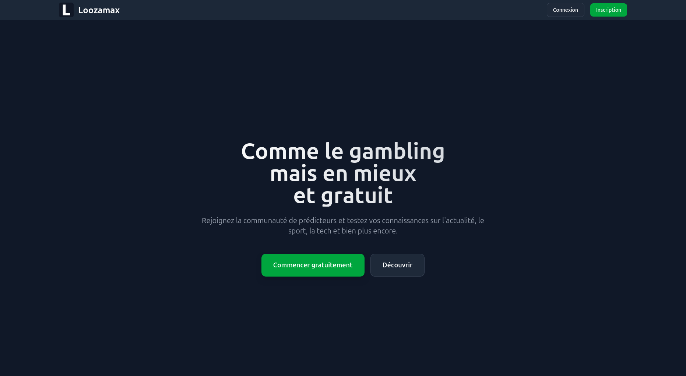
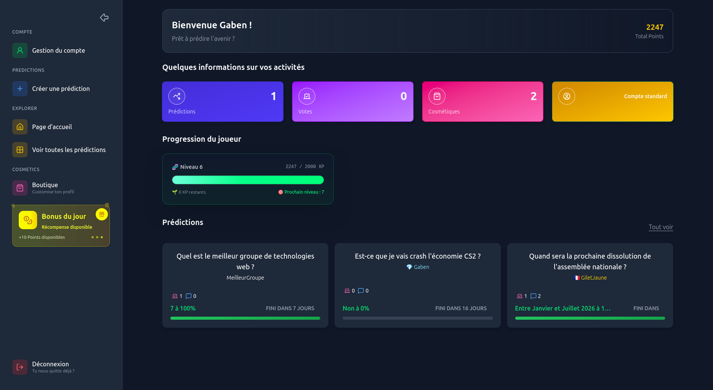
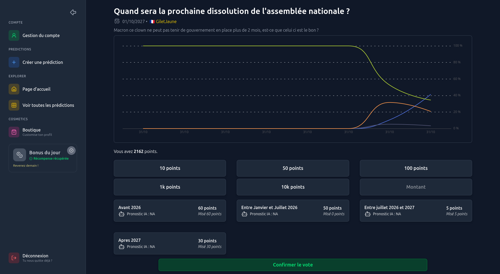
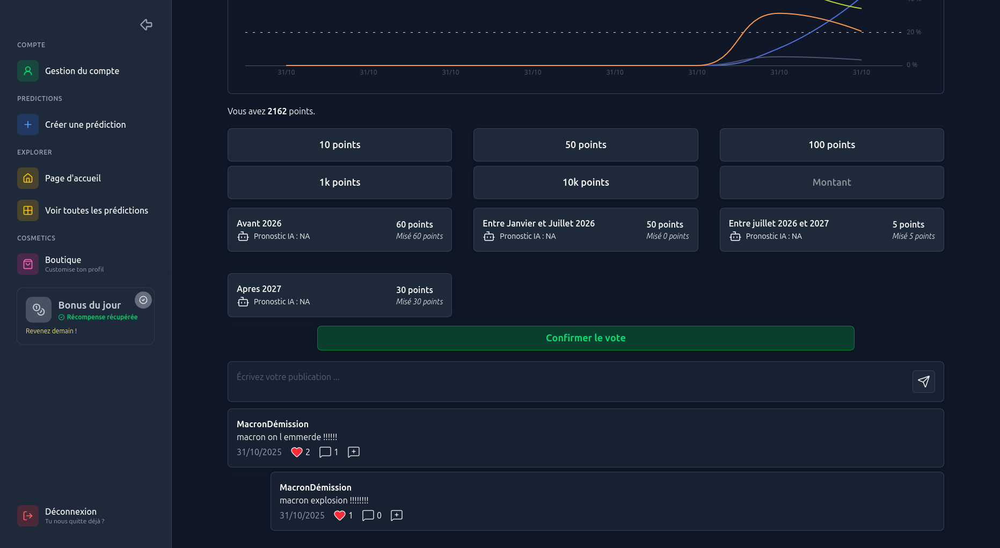
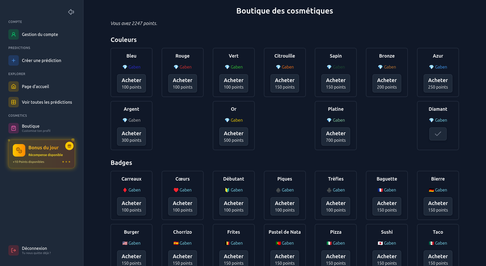
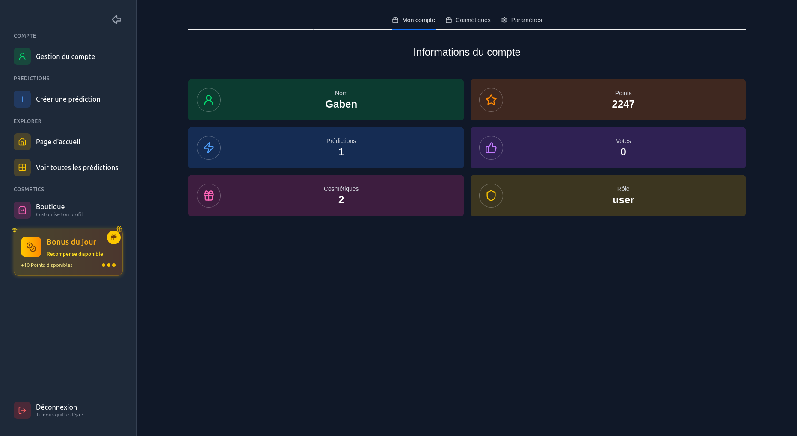

<a id="readme-top"></a>

<br />
<div align="center">
  <h1 align="center">Loozamax</h1>
  <h4 align="center">Groupe 7</h4>

  <h3><u>Description :</u></h3>
  <p>
    Loozamax est une plateforme de paris en ligne centrée sur les prédictions : les utilisateurs
    formulent des pronostics sur des événements (sportifs, culturels ou personnalisés), misent des
    points virtuels et suivent l'évolution des probabilités. 
  </p>
  <p>
    Fonctionnalités principales : création et gestion des prédictions, système de mises (votes),
    publications et discussions attachées à une prédiction, chronologie et historique des paris,
    système de points et boutique de cosmétiques pour personnaliser le profil, ainsi que des
    rôles utilisateurs (admin / user) pour la modération et la validation des résultats.
  </p>
  <p>
    Construit pour l'apprentissage et l'expérimentation, Loozamax est développé avec une
    architecture full‑stack moderne (React + Vite côté client, NestJS côté API, MongoDB pour la
    persistance) et les tests automatisés (Jest).
  </p>
</div>


<!-- TABLE OF CONTENTS -->
<details>
  <summary>Sommaire</summary>
  <ol>
    <li>
      <a href="#a-propos">A propos</a>
      <ul>
        <li><a href="#fait-avec">Fait avec</a></li>
        <li><a href="#documentation">Documentation</li>
      </ul>
    </li>
    <li>
      <a href="#pour-commencer">Pour commencer</a>
      <ul>
        <li><a href="#prérequis">Prérequis</a></li>
        <li><a href="#installation">Installation</a></li>
      </ul>
    </li>
    <li>
      <a href="#configuration">Configuration</a>
      <ul>
          <li><a href="#client">Client</a></li>
          <li><a href="#api">API</a></li>
      </ul>
    </li>
    <li><a href="#utilisation">Utilisation</a></li>
    <ul>
      <li><a href="#développement">Développement</a></li>
      <li><a href="#production">Production</a></li>
    </ul>
    <li><a href="#feuille-de-route">Feuille de route</a></li>
    <li><a href="#contact">Contact</a></li>
    <li><a href="#remerciements">Remerciements</a></li>
  </ol>
</details>

## A propos

### Fait avec

[![React][React.js]][React-url]
[![Nest][NestJS]][Nest-url] 
[![Vite][Vite]][Vite-url]
[![MongoDB][MongoDB]][MongoDB-url]
[![Jest][Jest]][Jest-url]
[![Tailwind][Tailwind]][Tailwind-url]








<p align="right">(<a href="#readme-top">revenir en haut</a>)</p>

### Documentation
Tableur d'avancement : [Google sheets](https://docs.google.com/spreadsheets/d/16UJ5eu9x0MTj6YgVtItG8Io4gMjyfLKyI22iAefOFXs/edit?usp=sharing)

Specification : [Google docs](https://docs.google.com/document/d/1QRYGtfH678zQ-XyCAZXBkuYG8LSYG_tSej-hMPigHOY/edit?usp=sharing)


<!-- GETTING STARTED -->
## Pour commencer

Pour obtenir une copie locale et la faire fonctionner, suivez ces étapes simples.

### Prérequis
* [npm](https://nodejs.org/en/download/current) version 7+ (recommandé npm 11+)
* [Node.js](https://nodejs.org/en/download/current) version 20+ (recommandé Node.js 24.x LTS)
* [MongoDB](https://www.mongodb.com/docs/manual/installation/) version 4.4+ 
* (Production) Serveur HTTP (NGINX, Apache, ...)
### Installation

1. Cloner le repo
   ```sh
   git clone https://github.com/Synnly/technos-web-m2
   ```
2. Installer les packages NPM 
   ```sh
   npm install
   ```

<p align="right">(<a href="#readme-top">revenir en haut</a>)</p>

## Configuration

### Client

Les variables d'environnement du client se situent dans le fichier `/apps/client/.env`.

#### URL de l'API
Modifiez `VITE_API_URL` pour configurer l'url de l'API

```env
VITE_API_URL=http://localhost:3000/api
```

### API

Les variables d'environnement de l'API se situent dans le fichier `/apps/api/.env`.

#### URL du client
Modifiez `CLIENT_URL` pour configuer l'url du client

```env
CLIENT_URL=http://localhost:5173
```

#### Port
Modifiez `PORT` pour configurer le port de l'API

```env
PORT=3000
```

#### Base de données
Modifiez `DATABASE_URL` pour configurer l'url de la base de données

```env
DATABASE_URL=mongodb://localhost/nest
```

#### Secret JWT
Modifiez `JWT_SECRET` pour modifier le secret JWT. Un secret de moins de 256 bits est déconseillé.

```env
JWT_SECRET=<secret JWT>
```

> [!IMPORTANT]
> Il est impératif de changer le secret JWT <ins>**AVANT**</ins> de lancer le projet


## Utilisation

## Développement
```sh
npm run dev
```

Par défaut, l'API est joignable à [localhost:3000](http://localhost:3000) et le client à [localhost:5173](http://localhost:5173)

Pour lancer seulement l'API
```sh
npm run api
```

Pour lancer seulement le client
```sh
npm run client
```

## Production
D'abord compilez le projet
```sh
npm run build
```

Puis démarrez l'API
```sh
npm run start
```

<p align="right">(<a href="#readme-top">revenir en haut</a>)</p>


<!-- ROADMAP -->
## Feuille de route
- [x] Création de compte
- [x] Connexion
- [x] Déconnexion
- [x] Suppression de compte
- [x] Modification de compte
- [x] Création de prédiction
- [x] Vote de prédiction
- [x] Confirmer le résultat d’une prédiction
- [x] Créer une publication sous une prédiction
- [x] Récupérer les points quotidiens
- [x] Répondre à une publication
- [x] Liker une publication
- [x] Changer de cosmétique
- [x] Acheter un cosmétique pour son profil
- [x] Valider une prédiction
- [x] Afficher les probabilités de la prédiction par IA
- [ ] Refonte de l'UI

<p align="right">(<a href="#readme-top">revenir en haut</a>)</p>


<!-- CONTACT -->
## Contact

Emanuel Fernandes dos Santos - [mail UL](mailto:emanuel.fernandes-dos-santos4@etu.univ-lorraine.fr) - [mail pro](mailto:emanuelfernandespro@gmail.com) <br>
Médéric Cuny - [mail UL](mailto:mederic.cuny9@etu.univ-lorraine.fr) - [mail pro](mailto:medericpro7@gmail.com)

Lien du projet: [https://github.com/Synnly/technos-web-m2](https://github.com/Synnly/technos-web-m2)

<p align="right">(<a href="#readme-top">revenir en haut</a>)</p>


<!-- ACKNOWLEDGMENTS -->
## Remerciements

Tutoriels
* https://blog.logrocket.com/full-stack-app-tutorial-nestjs-react/#building-the-nestjs-backend
* https://www.geeksforgeeks.org/reactjs/react-hook-form-create-basic-reactjs-registration-and-login-form/

<p align="right">(<a href="#readme-top">revenir en haut</a>)</p>


<!-- MARKDOWN LINKS & IMAGES -->
<!-- https://www.markdownguide.org/basic-syntax/#reference-style-links -->
[React.js]: https://img.shields.io/badge/React-20232A?style=for-the-badge&logo=react&logoColor=61DAFB
[React-url]: https://reactjs.org/
[NestJS]: https://img.shields.io/badge/NestJS-E0234E?style=for-the-badge&logo=nestjs&logoColor=#E0234E
[Nest-url]: https://nestjs.com/
[MongoDB]: https://img.shields.io/badge/MongoDB-FFFFFF?style=for-the-badge&logo=mongodb&logoColor=#47A248
[MongoDB-url]: https://mongodb.com
[Tailwind]: https://img.shields.io/badge/Tailwind%20CSS-06B6D4?style=for-the-badge&logo=tailwindcss&logoColor=white
[Tailwind-url]: https://tailwindcss.com
[Vite]: https://img.shields.io/badge/Vite-646CFF?style=for-the-badge&logo=vite&logoColor=white
[Vite-url]: https://vite.dev
[Jest]: https://img.shields.io/badge/Jest-C21325?style=for-the-badge&logo=jest&logoColor=white
[Jest-url]: https://vite.dev
